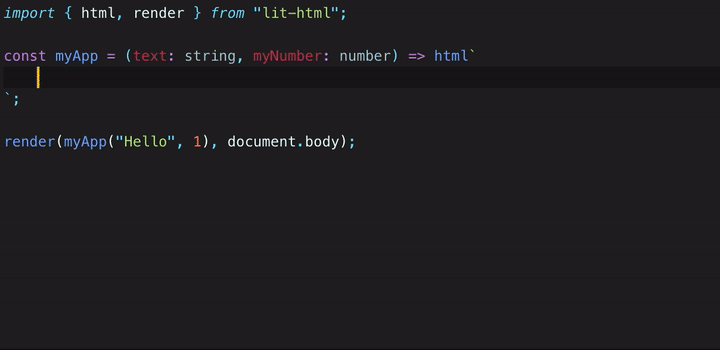

# Typescript HTML Plugin

Typescript plugin that adds type checking and code completion for html inside tagged template strings like [lit-html](https://github.com/polymer/lit-html).



<a href="https://npmcharts.com/compare/ts-html-plugin?minimal=true"></img></a>
<a href="https://david-dm.org/runem/ts-html-plugin"></img></a>
<a href="https://www.npmjs.com/package/ts-html-plugin"></img></a>
<a href="https://github.com/runem/ts-html-plugin/graphs/contributors"></img></a>
<a href="https://opensource.org/licenses/MIT"></img></a>

**Features**

-   Attribute type checking.
-   Report missing imports of custom elements.
-   Goto definition for tags and attributes.
-   Code completions for html tags and attributes.
-   Quick info on on hover for tags and attributes.
-   Required attributes not included
-   Auto closing tags.

## Install

### Visual Studio Code

If you use Visual Studio Code you can simply install the [tagged-html](https://marketplace.visualstudio.com/items?itemName=runem.tagged-html) extension.

```bash
code --install-extension runem.tagged-html
```

### Other

First, install the plugin:

```bash
npm install ts-html-plugin -D
```

Then add a `plugins` section to your [`tsconfig.json`](http://www.typescriptlang.org/docs/handbook/tsconfig-json.html):

<!-- prettier-ignore -->
```json
{
  "compilerOptions": {
    "plugins": [
      {
        "name": "ts-html-plugin",
        "flavor": "lit-html"
      }
    ]
  }
}
```

## Roadmap

-   Support for [web-components.json](https://github.com/w3c/webcomponents/issues/776)
-   Add tests
-   Aria/accessibility mode
-   SVG support
-   CSS support
-   Support "// @ts-ignore"
-   Type check events (onclick, @click, eg.)
-   Type check slots
-   **lit-html**: Directive type checking support.
-   **lit-element**: Better support for the @property({}) decorator taking metadata into account.
-   **vanilla**: Parse custom elements (observedAttributes, eg.)
